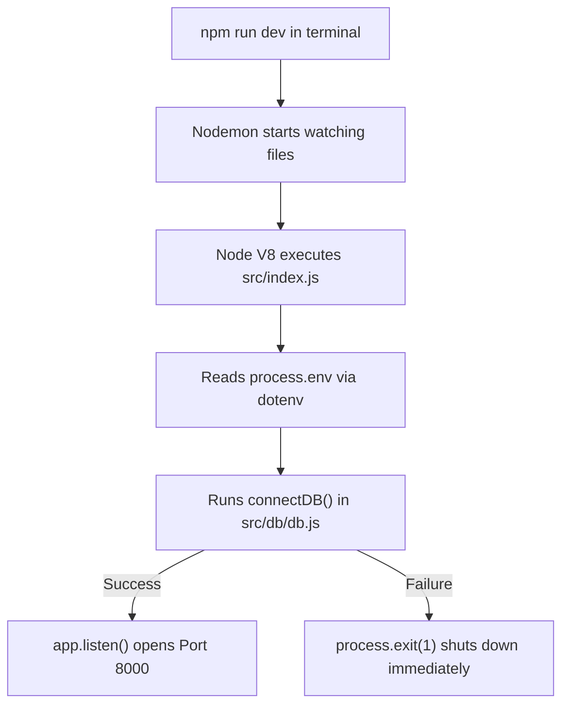

# 02 — Node.js Fundamentals

> **Focus:** Understanding the Node.js runtime, `package.json`, NPM scripts, the `process` global object, and `nodemon`.

---

### A. The Simple Idea
Node.js is an open-source, cross-platform JavaScript runtime environment built on Google Chrome's V8 engine. It allows developers to run JavaScript code outside of a web browser—directly on a server computer or local operating system.

---

### B. Why It Exists
Before Node.js (created in 2009 by Ryan Dahl), JavaScript could only execute inside web browsers to animate buttons or manipulate the DOM. If you wanted to build a backend, you had to learn PHP, Java, Python, or Ruby. Node.js brought non-blocking, event-driven I/O to JavaScript, allowing developers to write both frontend and backend using a single language.

---

### C. A Practical Analogy
Think of a web browser as an office building where JavaScript works as an interior designer (changing wall colors, arranging furniture). Node.js takes that same worker outside into the municipal operations center, giving them access to file cabinets (file system), electrical wiring (networking sockets), and city blueprints (system processes).

---

### D. The Technical Explanation
Node.js consists of:
1. **V8 Engine:** Converts JavaScript code directly into machine code.
2. **libuv:** A multi-platform C library that provides an event loop and asynchronous I/O (handling disk read/writes, network sockets, DNS lookups) using a background thread pool.
3. **Core APIs:** Built-in modules like `fs`, `path`, `http`, `crypto`, and the `process` global object.

Unlike the browser, Node.js has **no `window` object**, **no `document` object**, and **no DOM**. Instead, it has a global object named `global` and system tools like `process`.

---

### E. My Repository Implementation

#### 1. Manifest: `package.json`
Look at [`package.json`](../package.json):
```json
{
  "name": "video-streaming-backend-project",
  "version": "1.0.0",
  "description": "a backend project",
  "type": "module",
  "main": "index.js",
  "scripts": {
    "dev": "nodemon src/index.js"
  },
  "devDependencies": {
    "dotenv": "^18.0.6",
    "express": "^5.2.1",
    "mongoose": "^9.11.1",
    "nodemon": "^3.1.14",
    "prettier": "^3.9.9"
  },
  "dependencies": {
    "cookie-parser": "^1.4.7",
    "cors": "^2.8.6"
  }
}
```

- **`"type": "module"` (Line 11):** Instructs Node.js to use ES Module syntax (`import`/`export`) instead of default CommonJS (`require`/`module.exports`).
- **`"scripts": { "dev": "nodemon src/index.js" }` (Line 14):** Defines a shortcut command. When you run `npm run dev`, it launches `nodemon` targeting `src/index.js`.
- **`dependencies` vs `devDependencies`:**
  - `dependencies`: Packages required in production runtime (e.g., `cors`, `cookie-parser`).
  - `devDependencies`: Tools only required during development (e.g., `nodemon` for auto-restarts, `prettier` for code formatting). *(Note: `express` and `mongoose` are typically in `dependencies` for production deployments).*

#### 2. The `process` Global Object
Node provides `process`, which gives information and control over the currently executing Node.js process:

- **`process.env`:** An object containing all environment variables loaded by the system and `dotenv`.
  - Used in [`src/index.js:12`](../src/index.js#L12): `process.env.PORT`
  - Used in [`src/db/db.js:6`](../src/db/db.js#L6): `process.env.MONGODB_URI`
  - Used in [`src/app.js:9`](../src/app.js#L9): `process.env.CORS_ORIGIN`

- **`process.exit(code)`:** Instantly terminates the current Node process.
  - Used in [`src/db/db.js:11`](../src/db/db.js#L11):
    ```javascript
    catch(error){
        console.error("MONGODB connection Failed", error);
        process.exit(1);
        throw error;
    }
    ```
  - An exit code of `0` means "exited cleanly with no errors".
  - An exit code of `1` (or non-zero) tells the operating system: "The process crashed or exited due to an unrecoverable failure." If the database fails to connect, the server cannot function, so exiting immediately prevents the app from running in a broken state.

#### 3. Automatic Server Reloading: `nodemon`
In standard Node.js, running `node src/index.js` loads the code into memory. If you edit a file, the running process doesn't know about the changes until you manually stop and restart it.
- `nodemon` watches the files in your project directory.
- As soon as you save a `.js` or `.json` file, `nodemon` restarts the Node process automatically so your updates take effect immediately.

---

### F. JavaScript Prerequisite: Node Globals
In browser JavaScript, top-level variables belong to `window`. In Node.js:
- `global`: The root global namespace.
- `process`: Information about the current executing script and environment.
- `console`: Standard output formatting.

---

### G. Execution Flow


---

### H. What Happens If It Is Missing or Incorrect?
- **Running `node index.js` from root instead of `npm run dev`:** Node looks for `/Users/.../index.js` and fails with `Error: Cannot find module` because the file is located at `src/index.js`.
- **Omitting `"type": "module"` in `package.json`:** Node throws `SyntaxError: Cannot use import statement outside a module` as soon as it sees `import dotenv from "dotenv"`.

---

### I. Connection to Other Concepts
- Connects to [11-environment-variables-and-configuration.md](./11-environment-variables-and-configuration.md) for how `process.env` is populated.
- Connects to [04-express-fundamentals.md](./04-express-fundamentals.md) for how the Express server runs on the Node process.

---

### J. Quick Revision
- Node.js is a server-side JavaScript runtime powered by V8 and libuv.
- `package.json` defines your project metadata, scripts, and dependencies.
- `"type": "module"` enables ES Module `import`/`export`.
- `process.exit(1)` terminates the application on fatal errors.
- `nodemon` monitors files and restarts the server on file saves.

---

### K. Test Yourself
1. What is the difference between `npm run dev` and `node src/index.js`?
2. What does `process.exit(1)` do, and why is it used in `src/db/db.js`?
3. What error occurs if you try to use `import` without `"type": "module"` in `package.json`?
*(Answers can be reviewed in [revision/practice-questions.md](./revision/practice-questions.md))*
