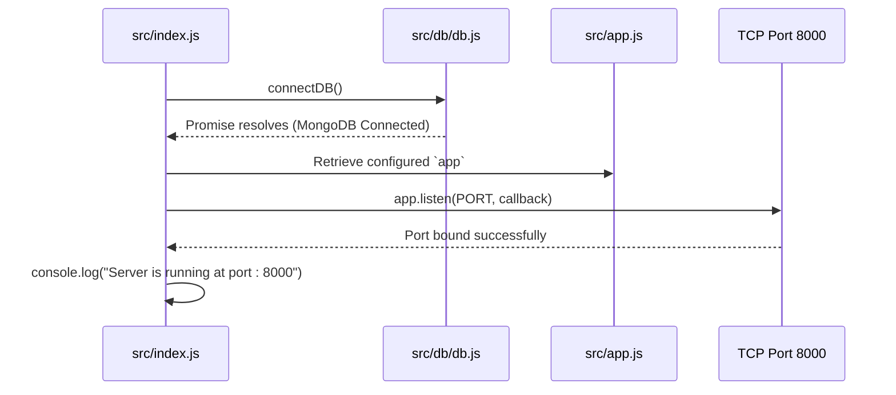

# 04 — Express.js Fundamentals & App Architecture

> **Focus:** Understanding the Express framework, the `app` instance, `app.use()`, `app.listen()`, and why `app.js` and `index.js` are separated.

---

### A. The Simple Idea
Express is a minimal and flexible web application framework for Node.js. It wraps Node's low-level HTTP module and provides a rich suite of routing, middleware management, request parsing, and error-handling tools to streamline backend development.

---

### B. Why It Exists: Node HTTP vs. Express
In pure Node.js (without Express), handling an HTTP request requires writing tedious, repetitive low-level boilerplate:
```javascript
// ❌ Pure Node.js (Primitive & Verbose)
import http from "http";

const server = http.createServer((req, res) => {
    if (req.url === "/api/users" && req.method === "POST") {
        let body = "";
        req.on("data", chunk => { body += chunk; });
        req.on("end", () => {
            const data = JSON.parse(body);
            res.writeHead(200, { "Content-Type": "application/json" });
            res.end(JSON.stringify({ success: true, data }));
        });
    } else {
        res.writeHead(404);
        res.end("Not Found");
    }
});
server.listen(8000);
```
In Express, all of that manual string chunking, URL splitting, and header configuration is abstracted into simple, chainable methods:
```javascript
// ✅ With Express
app.post("/api/users", (req, res) => {
    res.status(200).json({ success: true, data: req.body });
});
```

---

### C. A Practical Analogy: The Assembly Line
Imagine a car manufacturing assembly line:
- `const app = express()` builds the conveyor belt.
- Every `app.use(middleware)` stations a specialized robotic arm along the belt (one checks security passes, one inspects the payload, one adds cookies).
- The route controller at the end puts the finished car into a shipping box and sends it to the customer (`res.json()`).
- `app.listen()` switches on the factory's main power generator.

---

### D. The Technical Explanation
An Express application is essentially an event-driven function pipeline:
1. **Creation:** Calling `express()` creates an application object (`app`) containing internal routing tables, settings maps, and an array of middleware callbacks.
2. **Configuration:** Calling `app.use(fn)` pushes a middleware function onto Express's internal middleware stack.
3. **Routing:** Methods like `app.get()`, `app.post()`, or `app.use('/api', router)` register URL pattern matchers.
4. **Listening:** Calling `app.listen(port)` creates an underlying Node `http.Server` instance and starts listening on TCP sockets.

---

### E. My Repository Implementation

#### 1. Configuring the Application: [`src/app.js`](../src/app.js)
```javascript
import express from "express"
import cors from "cors"
import cookieParser from "cookie-parser"

const app = express();

// 1. CORS middleware
app.use(cors({
    origin: process.env.CORS_ORIGIN,
    credentials: true
})) 

// 2. Body parsers
app.use(express.json({ limit: "16kb" }))
app.use(express.urlencoded({ extended: true, limit: "16kb" }))

// 3. Static assets
app.use(express.static("public"))

// 4. Cookie parser
app.use(cookieParser())

export { app }
```

- **Line 5: `const app = express();`:** Instantiates the Express application object.
- **Lines 8-23: `app.use(...)`:** Registers our global middlewares in the exact sequence incoming requests must encounter them.
- **Line 27: `export { app }`:** Exports the configured app using a named export so other files can mount routes or start the server.

#### 2. Starting the Server: [`src/index.js`](../src/index.js#L11-L15)
```javascript
connectDB()
.then(() => {
    app.listen(process.env.PORT || 8000, () => {
        console.log(`Server is running at port : ${process.env.PORT}`)
    })
})
.catch((err) => {
    console.error("MONGODB connection failed !!", err);
})
```

- **`app.listen(port, callback)`:** Binds the server to the port specified in `.env` (or defaults to `8000` using the logical OR operator `||`).
- The callback function runs as soon as the port successfully opens, printing the confirmation message to the terminal.

---

### F. JavaScript Prerequisite: Default Values with Logical OR (`||`)
In line 12 of `src/index.js`:
```javascript
process.env.PORT || 8000
```
- In JavaScript, if `process.env.PORT` is defined (truthy, e.g. `8000`), the expression evaluates to that value.
- If `process.env.PORT` is `undefined` (falsy, because `.env` was missing or didn't define `PORT`), JavaScript falls back to `8000`. This prevents the application from failing to start due to an undefined port.

---

### G. Execution Flow


---

### H. What Happens If It Is Missing or Incorrect?
- **Missing `app` import in `src/index.js`:**  
  Currently in your `src/index.js`, line 12 calls `app.listen(...)`, but `import { app } from "./app.js";` is missing at the top of the file!  
  *Result:* Running `npm run dev` after MongoDB connects will throw:  
  `ReferenceError: app is not defined`
- **Calling `app.listen()` before `connectDB()` finishes:**  
  If incoming requests arrive while the database is still connecting, route controllers attempting to query MongoDB will fail or timeout.

---

### I. Connection to Other Concepts
- Connects to [06-middleware.md](./06-middleware.md) for detailed analysis of the middlewares registered in `src/app.js`.
- Connects to [07-routing-and-controllers.md](./07-routing-and-controllers.md) for how routes are mounted onto `app`.

---

### J. Quick Revision
- `express()` creates the application pipeline.
- `app.use()` registers global middleware.
- `app.listen()` binds the server to an operating system port.
- Keeping `app.js` and `index.js` separated ensures clear separation of concerns (configuration vs lifecycle).

---

### K. Test Yourself
1. Why do we export `app` from `app.js` instead of calling `app.listen()` right inside `app.js`?
2. What does `process.env.PORT || 8000` evaluate to if `process.env.PORT` is `undefined`?
3. What is the fundamental difference between building an HTTP server with pure Node.js vs Express?
*(Answers can be reviewed in [revision/practice-questions.md](./revision/practice-questions.md))*
