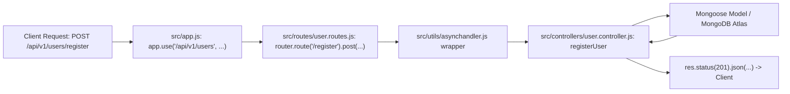

# 07 — Routing & Controllers Architecture

> **Focus:** Separation of concerns, how `express.Router()` works, and how the empty `src/routes/` and `src/controllers/` folders in your repository will be structured in the next Chai aur Code lessons.

---

### A. The Simple Idea
- A **Route** defines the endpoint address (URL path + HTTP method, e.g., `POST /api/v1/users/register`).
- A **Controller** contains the actual business logic executed when that route is hit (e.g., validate the email, hash the password, save to MongoDB, and return a response).

---

### B. Why It Exists: Separation of Concerns
If you write all your endpoints and business logic directly in `src/app.js`:
```javascript
// ❌ Poor Practice: Bloated app.js with 1,000 lines of mixed routes and database calls
app.post("/api/v1/users/register", async (req, res) => { ... });
app.post("/api/v1/users/login", async (req, res) => { ... });
app.get("/api/v1/videos", async (req, res) => { ... });
```
Your code quickly becomes an unmaintainable monolith.  
By separating **Routing** (`src/routes/`) from **Logic** (`src/controllers/`):
- Routes become a clean table of contents.
- Controllers become isolated, testable JavaScript functions.
- `app.js` remains clean and uncluttered.

---

### C. A Practical Analogy: The Switchboard Operator & Department Specialist
- **`app.js`:** The company headquarters building.
- **The Route (`src/routes/`):** The building's directory board / receptionist. When a visitor says, "I have a question about billing," the receptionist directs them to Floor 3, Room 302.
- **The Controller (`src/controllers/`):** The billing specialist in Room 302 who actually opens the ledger, reviews the account, and issues the refund.

---

### D. The Technical Explanation: `express.Router()`
Express provides a mini-application router via `express.Router()`:
```javascript
import { Router } from "express";
const router = Router();

// Define route and bind controller
router.route("/register").post(registerUser);

export default router;
```
Then in `app.js`, you mount that entire mini-router onto a base prefix path:
```javascript
app.use("/api/v1/users", userRouter);
```
When a client requests `POST /api/v1/users/register`, Express:
1. Matches `/api/v1/users` in `app.js`.
2. Strips the prefix and passes the remaining path (`/register`) to `userRouter`.
3. Matches `/register` with `POST` and invokes `registerUser`.

---

### E. My Repository Implementation & Upcoming Pattern

In your repository right now:
- [`src/routes/`](../src/routes) is currently an empty directory.
- [`src/controllers/`](../src/controllers) is currently an empty directory.

Here is the exact pattern you will implement in upcoming Chai aur Code lessons:

#### 1. The Controller: `src/controllers/user.controller.js` *(Illustrative Pattern)*
```javascript
// (Illustrative: to be created in upcoming lesson)
import { asyncHandler } from "../utils/asynchandler.js";

const registerUser = asyncHandler(async (req, res) => {
    // 1. Get user details from req.body
    // 2. Validate inputs
    // 3. Query DB
    // 4. Send response
    res.status(200).json({
        message: "ok"
    });
});

export { registerUser };
```

#### 2. The Route: `src/routes/user.routes.js` *(Illustrative Pattern)*
```javascript
// (Illustrative: to be created in upcoming lesson)
import { Router } from "express";
import { registerUser } from "../controllers/user.controller.js";

const router = Router();

router.route("/register").post(registerUser);

export default router;
```

#### 3. Mounting in `src/app.js`:
```javascript
// routes import
import userRouter from "./routes/user.routes.js";

// routes declaration
app.use("/api/v1/users", userRouter);
```

---

### F. JavaScript Prerequisite: Named vs Default Imports in Routing
Notice how exports are typically used here:
- Route files usually export a single router as default:
  ```javascript
  export default router;
  ```
  Allowing you to import it in `app.js` as:
  ```javascript
  import userRouter from "./routes/user.routes.js";
  ```
- Controller files often export multiple functions as named exports:
  ```javascript
  export { registerUser, loginUser, logoutUser };
  ```
  Allowing routes to selectively import only what they need:
  ```javascript
  import { registerUser, loginUser } from "../controllers/user.controller.js";
  ```

---

### G. Execution Flow


---

### H. What Happens If It Is Missing or Incorrect?
- **Forgetting to export router:** If `user.routes.js` forgets `export default router`, `app.js` will import `undefined`, causing:  
  `TypeError: Router.use() requires a middleware function but got a undefined`.
- **Forgetting `.js` in ESM imports:** Importing `./routes/user.routes` without `.js` will trigger Node's `ERR_MODULE_NOT_FOUND`.

---

### I. Connection to Other Concepts
- Connects to [08-async-javascript-and-errors.md](./08-async-javascript-and-errors.md) for how every controller is wrapped with `asyncHandler`.
- Connects to [04-express-fundamentals.md](./04-express-fundamentals.md) for how `app.use()` mounts mini-routers.

---

### J. Quick Revision
- Routes declare URL paths and HTTP methods; Controllers execute business logic.
- `express.Router()` creates modular route mini-applications.
- `app.use("/api/v1/prefix", router)` mounts a route module onto a base path.
- Keep route declarations declarative and lightweight; put heavy logic in controllers.

---

### K. Test Yourself
1. Why do we avoid writing database queries directly inside route files?
2. If a router defines `router.route("/login").post(...)` and is mounted with `app.use("/api/v1/users", router)`, what full URL must the client call?
3. What is the difference between `app.use()` and `app.get()`?
*(Answers can be reviewed in [revision/practice-questions.md](./revision/practice-questions.md))*
