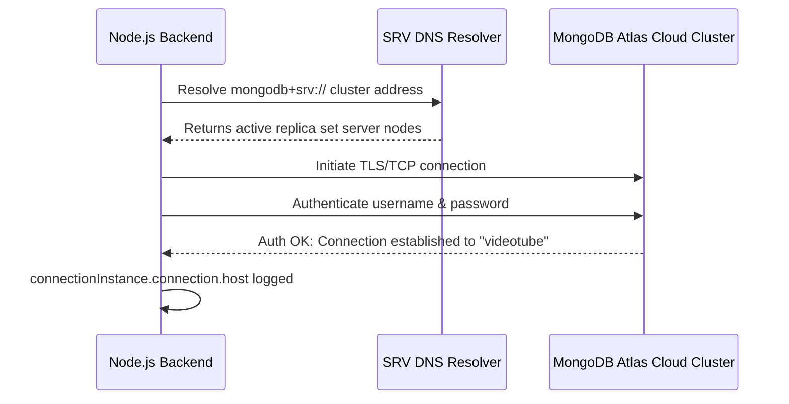

# 09 — Databases & MongoDB Fundamentals

> **Focus:** Understanding databases, SQL vs. NoSQL, MongoDB Atlas cloud clusters, connection URIs, and database naming conventions in your project.

---

### A. The Simple Idea
A database is specialized software designed to store, organize, query, and preserve data securely on persistent disk storage. MongoDB is a popular **NoSQL document database** that stores data as JSON-like documents (technically stored as BSON — Binary JSON) rather than rigid relational tables.

---

### B. Why It Exists: In-Memory vs Persistent Storage
If you store registered users in a JavaScript array:
```javascript
const users = []; // ❌ Lost on server restart!
```
The moment your server restarts, crashes, or is redeployed with `nodemon`, all data is wiped from RAM. A database permanently writes data to non-volatile disk storage and provides indexing, caching, access control, and transaction safety.

---

### C. A Practical Analogy: Filing Cabinets vs Rigid Excel Sheets
- **SQL (Relational Databases like PostgreSQL, MySQL):** An Excel workbook. Every row must strictly follow the column headers. If you want to add a column, every row in the sheet is affected.
- **MongoDB (Document Database):** A physical filing cabinet full of manila folders. Each drawer is a **Collection**, and each folder inside is a **Document** (a JSON object). One folder might contain a user with a phone number, while another folder for a different user might have two emails and no phone number.

---

### D. The Technical Explanation: Key Terminology Comparison

| Relational (SQL) Concept | MongoDB (NoSQL) Equivalent | What It Represents in Your App |
|:---|:---|:---|
| **Database** | **Database** | The entire container (`videotube`) |
| **Table** | **Collection** | A collection of related records (e.g. `users`, `videos`, `comments`) |
| **Row / Record** | **Document** | A single record stored as BSON (e.g. `{ _id: ..., username: "harshita" }`) |
| **Column / Field** | **Field** | A key-value pair inside the document (`username: "harshita"`) |
| **Primary Key (`id`)** | **`_id` (`ObjectId`)** | An auto-generated 12-byte unique identifier |

#### What is BSON?
MongoDB internally stores documents in **BSON** (Binary JSON). BSON extends JSON by adding support for data types not native to JSON, such as:
- `ObjectId`: 12-byte unique hash for document IDs.
- `Date`: Stored as a 64-bit integer representing milliseconds.
- Raw binary data and 64-bit integers.

---

### E. My Repository Implementation

#### 1. Isolating the Database Name: [`src/constants.js`](../src/constants.js)
```javascript
export const DB_NAME = "videotube"
```
- **Why is `DB_NAME` kept in `constants.js` instead of `.env`?**  
  In Chai aur Code, Hitesh separates application-level static constants from secret environment configurations. Your database name (`"videotube"`) is not a secret credential; it is a permanent structural constant of your application. Putting it in `constants.js` avoids cluttering `.env` and allows multiple developers to share the same DB name while using their own separate connection strings.

#### 2. The Connection String Format in `.env`
In your `.env` file, you configured:
```env
MONGODB_URI = mongodb+srv://<username>:<password>@<cluster-url>.mongodb.net
```
*(Always use safe placeholders like `<username>` in documentation to prevent credential leaks!)*

- **`mongodb+srv://`:** A specialized DNS seedlist protocol that allows MongoDB clients to automatically discover replica set members and shard routers without listing every server IP address manually.
- **`<username>:<password>`:** Your database user credentials created in MongoDB Atlas Database Access.
- **`@<cluster-url>.mongodb.net`:** The cloud address of your distributed MongoDB Atlas cluster.
- Notice that in your `.env`, the URI does **NOT** include the database name at the end! The database name is appended programmatically in `src/db/db.js`:
  ```javascript
  `${process.env.MONGODB_URI}/${DB_NAME}`
  ```

---

### F. JavaScript Prerequisite: URL Formatting
When concatenating connection URLs:
```javascript
`${process.env.MONGODB_URI}/${DB_NAME}`
```
- If `MONGODB_URI` ends with a trailing slash (`/`), concatenating another slash (`//videotube`) can cause connection parser errors.
- Always verify that your base URI in `.env` does not have an unintended trailing slash.

---

### G. Execution Flow: Atlas Cloud Handshake


---

### H. What Happens If It Is Missing or Incorrect?
- **IP Whitelist Error (`MongoServerSelectionError`):**  
  MongoDB Atlas blocks all incoming connections by default for security. If your IP address changes or you connect from a new Wi-Fi network, Atlas will refuse the connection until you add your current IP address to the **Network Access IP Access List** in the MongoDB Atlas dashboard (or allow `0.0.0.0/0` during development).
- **Bad Password / Auth Failure:**  
  MongoDB throws `MongoServerError: bad auth : authentication failed`.

---

### I. Connection to Other Concepts
- Connects to [10-mongoose.md](./10-mongoose.md) for how Mongoose manages schemas and queries on top of MongoDB.
- Connects to [11-environment-variables-and-configuration.md](./11-environment-variables-and-configuration.md) for how `MONGODB_URI` is securely kept out of source code.

---

### J. Quick Revision
- MongoDB is a NoSQL document database storing BSON documents in collections.
- `DB_NAME = "videotube"` is stored in `constants.js` to separate constants from secrets.
- `mongodb+srv://` uses DNS seedlists to connect to Atlas cloud clusters.
- If MongoDB fails to connect, check your MongoDB Atlas **IP Whitelist** and database user credentials.

---

### K. Test Yourself
1. What is the MongoDB equivalent of a SQL "Table"?
2. Why is the database name kept in `src/constants.js` instead of being hardcoded into the `.env` connection string?
3. What is BSON, and how does it differ from standard JSON?
*(Answers can be reviewed in [revision/practice-questions.md](./revision/practice-questions.md))*
