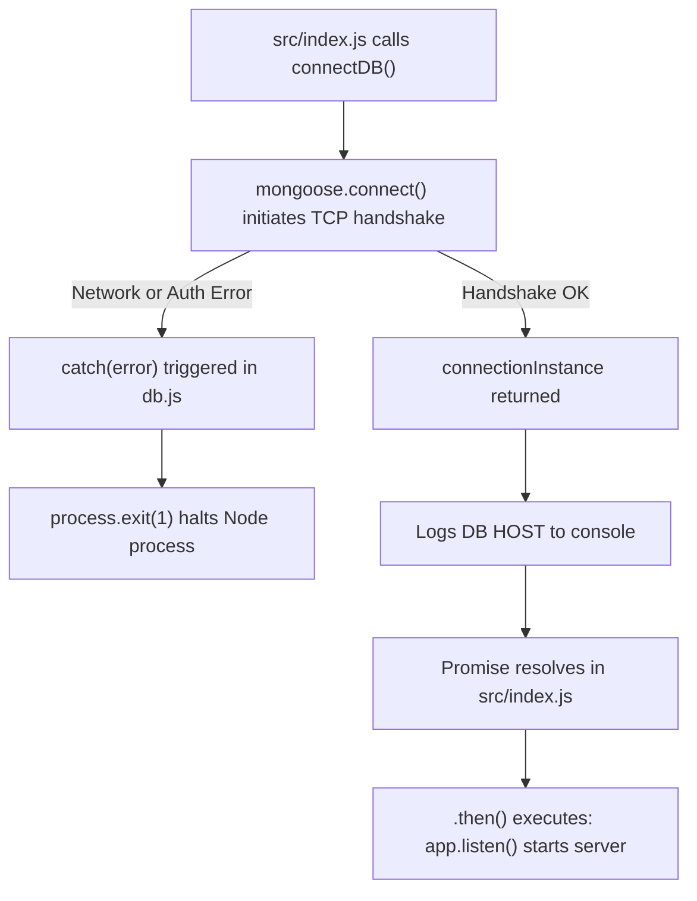

# 10 — Mongoose ODM & Database Connection

> **Focus:** Understanding Mongoose as an Object Data Modeling (ODM) library, line-by-line breakdown of `src/db/db.js`, connection instance monitoring, and error handling.

---

### A. The Simple Idea
Mongoose is an ODM (Object Data Modeling) library for MongoDB and Node.js. It acts as a structured translator between your JavaScript objects and MongoDB's database engine, providing schema definitions, data validation, type casting, middleware hooks, and query helpers.

---

### B. Why It Exists: Native MongoDB Driver vs Mongoose
MongoDB is schemaless by default—it will happily allow you to insert `{ username: "harshita", age: 22 }` and in the very same collection insert `{ title: "My Video", views: "ten" }`!  
Without schema enforcement at the application layer:
- Inconsistent data corrupts application logic.
- You have to write manual validation for every field in every route.
Mongoose solves this by introducing **Schemas**: strict blueprints that define data types, required fields, default values, and validation rules before anything touches the database.

---

### C. A Practical Analogy: The Quality Control Inspector & Architectural Blueprint
- **MongoDB:** An open construction yard where bricks and steel can be stacked in any pile.
- **Mongoose:** The municipal architect and building inspector who insists that every house follow a blueprint (**Schema**). If a contractor tries to build a room without an entrance (**required field**), Mongoose rejects it before construction begins.

---

### D. The Technical Explanation: The Mongoose Connection Instance
When you call `mongoose.connect(uri)`, Mongoose creates a persistent TCP connection pool to the MongoDB server and returns a `Mongoose` object.  
This object contains `.connection`, which provides critical metadata about the active connection:
- `connection.host`: The exact hostname/IP of the MongoDB server node currently connected.
- `connection.port`: The port MongoDB is listening on (usually 27017).
- `connection.name`: The database name being used.
- `connection.readyState`: Numeric connection status (`0` = disconnected, `1` = connected, `2` = connecting, `3` = disconnecting).

---

### E. My Repository Implementation: Line-by-Line Breakdown of [`src/db/db.js`](../src/db/db.js)

Here is your exact file:
```javascript
import mongoose from 'mongoose';
import {DB_NAME} from "../constants.js";

const connectDB = async function(){
    try{
        const connectionInstance = await mongoose.connect(`${process.env.MONGODB_URI}/${DB_NAME}`)
        console.log(`/n MONGODB connected !! DB HOST: ${connectionInstance.connection.host}`)
    }
    catch(error){
        console.error("MONGODB connection Failed", error);
        process.exit(1)
        throw error;
        
    }
}

export default connectDB
```

#### Detailed Line-by-Line Analysis:
- **Line 1: `import mongoose from 'mongoose';`**  
  Imports the default Mongoose library using ES Module syntax.
- **Line 2: `import {DB_NAME} from "../constants.js";`**  
  Imports the database name constant (`"videotube"`) using a named import with the mandatory `.js` extension.
- **Line 4: `const connectDB = async function(){`**  
  Declares an asynchronous function expression assigned to `connectDB`. Because it is marked `async`, calling `connectDB()` returns a JavaScript Promise.
- **Line 5: `try {`**  
  Opens a protective try-catch block to handle any network or authentication errors.
- **Line 6: `const connectionInstance = await mongoose.connect(`${process.env.MONGODB_URI}/${DB_NAME}`)`**  
  - Interpolates the base URI and database name.
  - `await` pauses execution of `connectDB` until the network connection to MongoDB completes.
  - Stores the returned connection object in `connectionInstance`.
- **Line 7: `console.log(`/n MONGODB connected !! DB HOST: ${connectionInstance.connection.host}`)`**  
  - Logs confirmation to the console upon successful connection.
  - `${connectionInstance.connection.host}` prints the exact cluster host node you connected to (e.g. `harshita-shard-00-01.lsa3bp4.mongodb.net`), confirming that you are talking to the correct database and not a local fallback.
  - *(Note: You wrote `/n` instead of `\n` — a forward slash is printed literally, whereas a backslash `\n` creates a newline in console logs).*
- **Line 9-14: `catch(error) { ... }`**  
  - If the connection fails, logs the error message to `console.error`.
  - `process.exit(1)`: Immediately terminates the Node.js process so the server does not attempt to serve requests with a broken database.
  - `throw error;`: Re-throws the error up to the `.catch()` block in `src/index.js`.
- **Line 16: `export default connectDB`**  
  Exports `connectDB` as the default export of this file.

---

### F. JavaScript Prerequisite: `async function` Expressions vs Declarations
In JavaScript, functions can be written in multiple ways:
```javascript
// Function Declaration
async function connectDB() { ... }

// Function Expression (Used in your code)
const connectDB = async function() { ... };

// Arrow Function Expression
const connectDB = async () => { ... };
```
All three forms are functionally equivalent when called asynchronously. Function expressions assigned to `const` prevent accidental re-assignment of the variable name elsewhere in the file.

---

### G. Execution Flow: Startup & Connection Lifecycle


---

### H. What Happens If It Is Missing or Incorrect?
- **Missing `await` before `mongoose.connect()`:**  
  `connectionInstance` would be assigned a pending Promise rather than the resolved connection object! Line 7 would throw `TypeError: Cannot read properties of undefined (reading 'connection')`.
- **Missing the `.js` extension on import:**  
  Node throws `ERR_MODULE_NOT_FOUND` as experienced previously.

---

### I. Connection to Other Concepts
- Connects to [08-async-javascript-and-errors.md](./08-async-javascript-and-errors.md) for Promise resolution.
- Connects to [09-databases-and-mongodb.md](./09-databases-and-mongodb.md) for how the URI is formatted.

---

### J. Quick Revision
- Mongoose is an ODM that provides schemas and validation on top of MongoDB.
- `await mongoose.connect(uri)` connects asynchronously and returns a connection instance.
- `connectionInstance.connection.host` confirms which MongoDB server cluster node is serving requests.
- `process.exit(1)` ensures the app fails fast if the database is down.

---

### K. Test Yourself
1. What does `connectionInstance.connection.host` tell you during server startup?
2. Why is `await` required before `mongoose.connect()`?
3. What is the difference between a function declaration and a function expression assigned to `const`?
*(Answers can be reviewed in [revision/practice-questions.md](./revision/practice-questions.md))*
