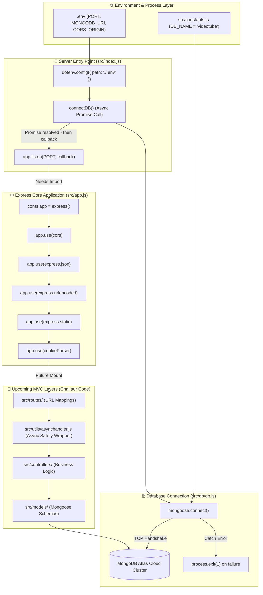

# 📐 Application Architecture Diagram

> **Focus:** Full visual topology of your backend codebase, illustrating how entry points, configuration, database connectivity, and middleware modules interact.

---

## 🏛️ System Architecture Map

---

## 🔍 Detailed Diagram Walkthrough

### 1. The Environment & Entry Point (`src/index.js`)

- Execution starts in `src/index.js`.
- It loads `.env` variables via `dotenv.config()`.
- It calls `connectDB()`, initiating an asynchronous network connection to MongoDB Atlas.

### 2. The Database Layer (`src/db/db.js`)

- `connectDB()` pulls `process.env.MONGODB_URI` and combines it with `DB_NAME` from `src/constants.js`.
- It establishes a connection via `mongoose.connect()`.
- If the connection fails, `process.exit(1)` immediately halts the Node process to prevent serving requests without a database.
- If successful, the Promise resolves, allowing the `.then()` block in `src/index.js` to execute.

### 3. The Server Launch

- Inside the `.then()` block, `app.listen(PORT)` is called to start listening for incoming HTTP connections on port 8000.
- _(Audit Note: `import { app } from "./app.js";` must be present in `src/index.js` for this step to succeed)._

### 4. The Express Middleware Pipeline (`src/app.js`)

- Once `app.listen()` receives an incoming HTTP request, it flows down the middleware chain registered in `src/app.js`:
  1. `cors`: Validates origin and headers.
  2. `express.json`: Parses incoming JSON body (up to 16kb).
  3. `express.urlencoded`: Parses URL form data (up to 16kb, extended).
  4. `express.static`: Serves files from `public/` if found.
  5. `cookieParser`: Extracts cookies from headers.

### 5. Future MVC Layer

- In the next lessons, routes in `src/routes/` will be mounted onto `app`.
- Route controllers in `src/controllers/` will be wrapped in `src/utils/asynchandler.js` and will interact with MongoDB through Mongoose schemas in `src/models/`.
