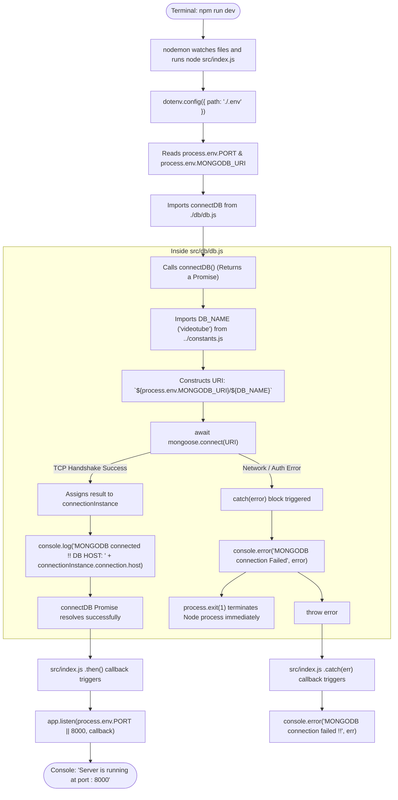

# 🗄️ Database Startup & Connection Flow Diagram

> **Focus:** Visualizing the asynchronous database connection lifecycle, error interception, environment variable resolution, and server port binding.

---

## 🔁 Complete Connection Lifecycle Flowchart

---

## 🔍 Critical Inspection Insights

### 1. The Two-Layer Safety Net
Notice that there are two levels of error logging:
- **Inner Level (`src/db/db.js`):** Catches the Mongoose connection error directly, logs it, calls `process.exit(1)`, and re-throws the error.
- **Outer Level (`src/index.js`):** Catches any error rejected by the `connectDB()` Promise via `.catch()`.

### 2. Why `process.exit(1)` Is Essential
If MongoDB Atlas is unreachable (for example, your home Wi-Fi IP address is not whitelisted on Atlas), allowing the server to call `app.listen()` would result in a **zombie server**—a server that appears to run and accepts incoming user requests, but crashes on every single request because the database connection is dead. `process.exit(1)` ensures a clean, immediate shutdown with a clear error trace.
