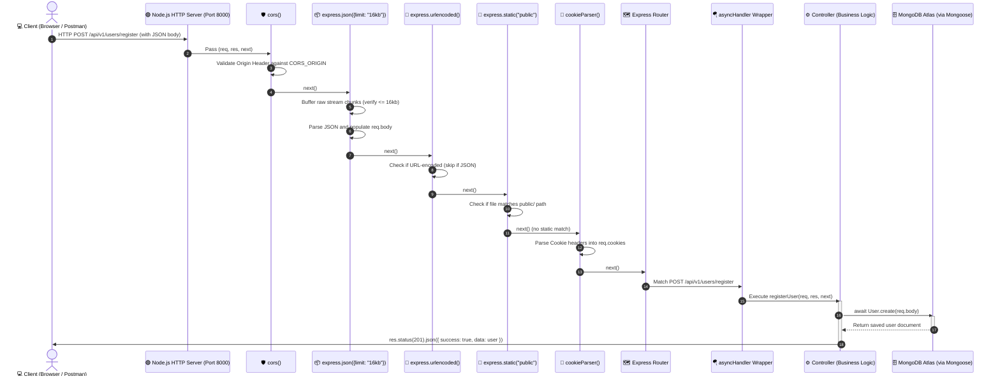
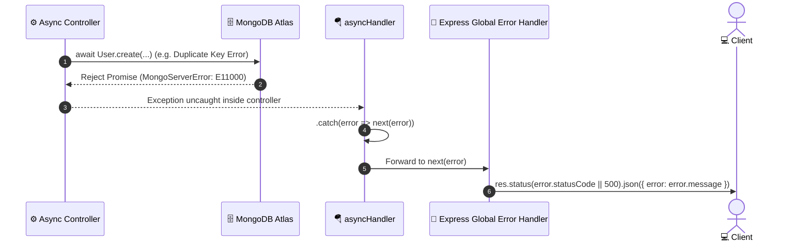

# 🔄 Request-Response Lifecycle Flow Diagram

> **Focus:** Detailed sequence diagram showing how an incoming HTTP request travels through the middleware stack, enters an asynchronous controller wrapped in `asyncHandler`, interacts with the database, and returns as an HTTP response.

---

## ⚡ Sequence Diagram: Full HTTP Lifecycle

---

## 🛑 What Happens When an Error Occurs?

---

## 📖 Key Takeaways from the Diagrams

1. **Ordering is Absolute:** Notice how middlewares execute in steps 2 through 7. If `express.json()` were placed after step 8 (the router), the controller in step 10 would receive `req.body === undefined`.
2. **`next()` is the Baton:** Like runners in a relay race, each middleware must hand off the baton by calling `next()`. If one runner stops and doesn't pass the baton, the request hangs forever.
3. **`asyncHandler` Intercepts Failures:** If MongoDB throws an error (e.g. invalid password, duplicate email, timeout), `asyncHandler` captures the rejection in `.catch()` and invokes `next(error)`, directing the flow to Express's error handling.
